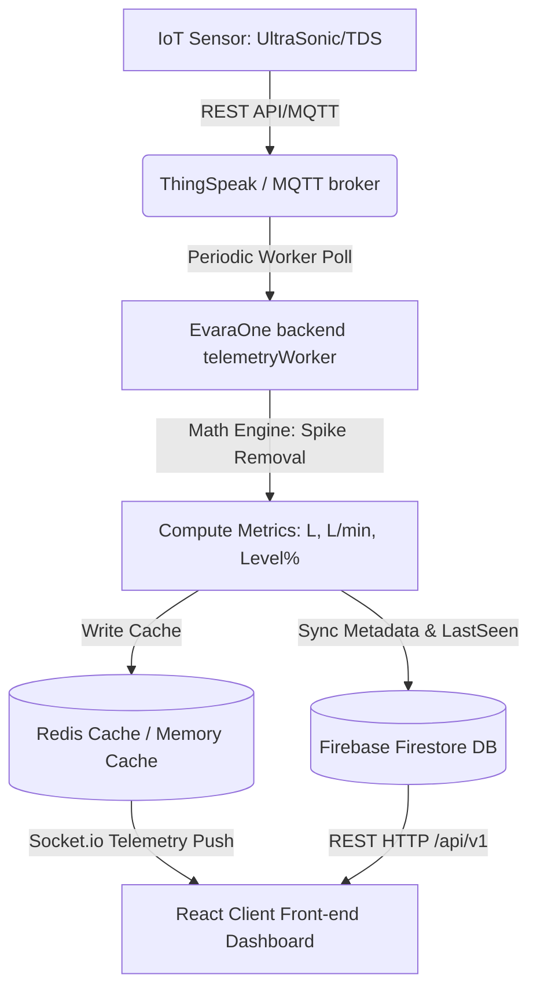

# 01. Project Overview

## A. Website Name & Core Definition
* **Website Name**: EvaraOne
* **Slogan / Focus**: Next-Generation Smart Water Telemetry & Analytics Platform
* **Access URL (Local Dev)**: `http://localhost:8081`

EvaraOne is an advanced, high-fidelity Internet of Things (IoT) visualization and management platform designed to monitor, analyze, and regulate liquid infrastructure. By integrating hardware telemetry (via ThingSpeak and MQTT pipelines) with high-density web visualization interfaces, EvaraOne provides consumer dashboards and administrative consoles to manage and conserve water resources.

---

## B. Problem Statement
Water resource infrastructure in modern smart buildings, agricultural cooperatives, and municipal regions suffers from critical operational gaps:
1. **Zero Real-time Visibility**: Facility operators rely on manual inspection of overhead tanks or pressure lines, leading to unmitigated leakage and sudden dry spells.
2. **Telemetry Incoherencies**: Existing sensors suffer from electrical noise, environmental scattering, and raw telemetry spikes that falsify level and consumption trends.
3. **Inefficient Energy Usage**: Water pumps (motors) run either on unoptimized cycles or dry run, drastically reducing motor lifespan and wasting electric power.
4. **Lack of Tenant Tenancy Isolation**: In multi-tenant environments, water consumption charges are divided evenly instead of being calculated on an individual consumption basis.

---

## C. Purpose & Objectives
The purpose of EvaraOne is to provide a central, multi-tenant digital hub that:
* **Ingests and Cleanses Telemetry**: Instantly processes distance data from ultrasonic/radar sensors, applying automated spike-removal filters to ensure 99.9% data reliability.
* **Calculates Advanced Hydro-Metrics**: Translates raw distances into water levels, volumes in liters, consumption flow rates, and time-to-empty/time-to-full estimations.
* **Controls and Regulates Devices**: Integrates smart electronic valves and automated motor starters to close or open liquid flow dynamically based on thresholds.
* **Aggregates Hierarchical Tenancy**: Groups assets under regions, zones, and customers, allowing administrative oversight of municipal-scale installations.

---

## D. Stakeholders & Target Audience
* **End Users / Customers**: Residents, tenants, and building managers who need real-time awareness of tank volumes, flow consumption rates, and water quality index (TDS/pH).
* **Community / Zone Administrators**: Facility management agencies and municipal officers responsible for water distribution across zones, parks, and housing tracts.
* **Superadmins**: System owners, engineers, and provisioning administrators who onboard clients, adjust global parameters, inspect telemetry caches, and configure hardware mapping.

---

## E. Scope of Project & Core Features
1. **Multi-Tenant Hierarchy Tree**: Administrative zone mapping representing structured regional branches (e.g., North Zone, South Zone) down to individual client meters.
2. **Dynamic 3D & Vector Tank Visualizers**: High-fidelity representations (such as threeJS-powered `RealisticTank` and interactive SVG indicators) demonstrating liquid level changes.
3. **TDS Quality Analytics**: Real-time Total Dissolved Solids tracking, mapping sensor telemetry to actionable clean-water indicator states.
4. **Interactive Analytics Panels**: Custom Recharts visualization of consumption metrics, level trends, weekly comparisons, and peak-usage alerts.
5. **Onboarding Tour & Guided Assistance**: Built-in interactive site tours using `driver.js` that visually guide new users through complex telemetry parameters.
6. **Robust REST & WebSocket API**: Fast Express 5 server routing and Socket.io subscriptions providing instant telemetry pushes.

---

## F. High-Level Workflow Summary

---

## G. Future Scalability Possibilities
1. **AI-Driven Leakage Localization**: Implementing regression models inside the telemetry pipeline to recognize micro-leakage anomalies during typical "STABLE" consumption periods.
2. **Smart Grid Integration**: Coordinating automated pump (motor) refilling cycles with municipal off-peak electricity schedules to minimize utility costs.
3. **Advanced Flow Meter Automation**: Introducing remote hardware command triggers to valves via dual-channel MQTT brokers directly from the UI console.
