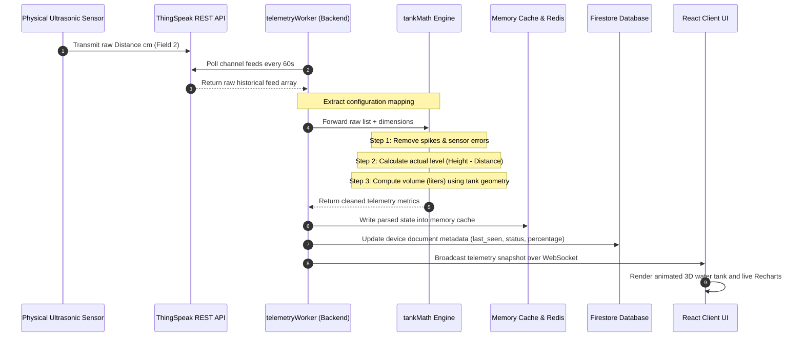

# 05. System Architecture Documentation

## A. High-Level Core Architecture
EvaraOne is structured as a robust **client-server monorepo application** featuring real-time stream processing, multi-layer caching, and a multi-tenant NoSQL database layout.

```mermaid
graph LR
    subgraph Client Layer (React 19)
        A[Browser Client]
        H[Socket.io-Client]
        I[React Query / Axios]
    end

    subgraph API & Event Server (Node.js/Express 5)
        B[Express API Server]
        J[Socket.io Server]
        K[telemetryWorker]
        L[deviceStatusCron]
    end

    subgraph Persistence & Caching
        C[(Firebase Auth)]
        D[(Firebase Firestore)]
        E[(Redis Cache)]
        F[Node Memory Cache]
    end

    subgraph Hardware & Stream Sources
        G[ThingSpeak REST API]
        M[MQTT Broker]
    end

    A -->|WS Telemetry Sub| H
    H <-->|WebSocket Connection| J
    A -->|REST API Requests| I
    I -->|HTTP REST| B
    B -->|User Auth Verification| C
    B <-->|Read/Write Metadata| D
    B <-->|Quick Caching| E
    K -->|Poll Raw feeds| G
    K -->|Subscribe topics| M
    K -->|Tank Calculations| F
    K -->|Persist last_seen| D
    K -->|Midnight baseline snap| E
    J <-->|Fetch state cache| F
```

---

## B. Client-Server Interaction & Lifecycle
1. **Initial Authentication**:
   * The client authenticates directly with Firebase Client Auth.
   * On validation, the client captures the JWT ID Token and forwards it in the headers (`Authorization: Bearer <Token>`) to the Node.js API server.
   * The Node server verifies the signature using `firebase-admin` and looks up the corresponding document in the Firestore `customers` or `superadmins` collection.

2. **API Data Lifecycle (TanStack React Query)**:
   * REST requests are handled via TanStack React Query to maximize efficiency and control firestore reads.
   * Standard caching properties (`staleTime: 10m`, `gcTime: 30m`) prevent unnecessary network polling when users navigate between views.

3. **Real-time Event Stream (Socket.io)**:
   * To display live updates (e.g., instant tank level percentage shifts, motor starters switching, flow rates rising), the client opens a secure Socket.io connection.
   * Telemetry updates are computed in the backend and broadcasted to active sockets based on the user's tenant ID, preventing cross-tenant data leaks.

---

## C. The Telemetry Pipeline & Computational Engine
The telemetry processing flow is designed to handle noisy data and provide accurate water volume metrics:



---

## D. Advanced Water Math Engine (`tankMath.js`)
At the center of the processing pipeline sits the **Tank Mathematics Engine** (`tankMath.js`), which processes several critical metrics:
* **Distance to Height Translation**:
  $$\text{Water Level (cm)} = \text{Height (cm)} - \text{Raw Distance (cm)}$$
  *If the sensor distance is greater than the configured height, the engine caps the level at 0 to avoid negative percentage outputs.*

* **Spike Removal Filtering**:
  To protect charts from noisy ultrasonic sensor data caused by steam or condensation, EvaraOne implements a rolling mathematical deviation filter. Any distance reading that deviates from the moving average of the last 5 points by more than a set variance is discarded.

* **Flow Rate Estimation**:
  $$\text{Flow Rate (L/min)} = \frac{\Delta \text{Volume (L)}}{\Delta \text{Time (min)}}$$
  *If $\Delta \text{Volume}$ is negative, EvaraOne reports a **Drain Rate** (Consumption). If positive, it reports a **Refill Rate**.*

* **Estimated Time Calculations**:
  $$\text{Time to Empty (min)} = \frac{\text{Current Volume (L)}}{\text{Drain Rate (L/min)}}$$
  $$\text{Time to Full (min)} = \frac{\text{Remaining Capacity (L)}}{\text{Fill Rate (L/min)}}$$
