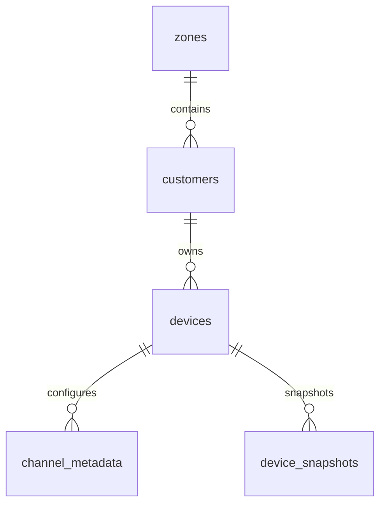

# 11. Database Documentation

## A. Database Model: NoSQL Document Store (Firebase Firestore)
EvaraOne utilizes a multi-tenant NoSQL layout in **Google Firebase Firestore** to store system configurations, user profiles, and operational logs.

---

## B. Schema Specifications & Collections

### 1. `zones` Collection
Stores regional structures and district groups.
* **Document ID**: Unique alphanumeric string (e.g., `zone_north_district`)
* **Properties**:
  * `name` (string): Distinct zone label.
  * `region` (string): Broad geographical boundary.
  * `created_at` (string): ISO timestamp.

### 2. `customers` Collection
Stores registered user accounts and their subscription plans.
* **Document ID**: User's Firebase UID (e.g., `firebase_user_id_123`)
* **Properties**:
  * `full_name` (string): User's profile display name.
  * `email` (string): Registered email address.
  * `role` (string): Account access role (`customer`, `community_admin`, `superadmin`).
  * `plan` (string): Subscription tier (`free`, `pro`, `enterprise`).
  * `zone_id` (string): Parent zone mapping ID.
  * `created_at` (string): ISO timestamp.

### 3. `devices` Collection
Stores physical hardware configurations, sensor mappings, and dimensions.
* **Document ID**: Hardware ID / Device ID (e.g., `ev_tank_001`)
* **Properties**:
  * `name` (string): Device label (e.g., "Main Storage Tank").
  * `device_type` (string): Device classification (`EvaraTank`, `EvaraFlow`, `EvaraDeep`, `EvaraMotor`, `EvaraValve`).
  * `status` (string): Device status (`ONLINE`, `OFFLINE`).
  * `owner_id` (string): References the owner's customer ID.
  * `last_seen` (string): ISO timestamp of the last telemetry transmission.
  * `last_value` (number): Last computed level or value.
  * **`configuration`** (map):
    * `thingspeak_channel_id` (string): Channel ID for data polling.
    * `thingspeak_read_api_key` (string): API key to access channel data.
    * `height_cm` (number): Physical depth/height of the tank.
    * `length_cm` (number): Tank length dimensions.
    * `breadth_cm` (number): Tank width dimensions.
  * **`sensor_field_mapping`** (map):
    * `water_level` (string): Mapped ThingSpeak field key (e.g., `field2`).
    * `tds` (string): Mapped ThingSpeak field key (e.g., `field1`).
  * **`visibility_controls`** (map):
    * `visible_on_dashboard` (boolean): Controls dashboard visibility.
    * `show_level` (boolean): Show/hide level indicators.
    * `show_flow` (boolean): Show/hide flow trend charts.
    * `show_quality` (boolean): Show/hide TDS indicators.

### 4. `device_snapshots` Collection
Stores midnight baseline snapshots used to track daily consumption.
* **Document ID**: Composite key format: `{deviceId}_{dateString}`
* **Properties**:
  * `volumeLitres` (number): Measured water volume at midnight.
  * `date` (string): Snapshot date string (e.g., `Tue May 26 2026`).

---

## C. Caching Strategy
To prevent high firestore read costs and ensure fast API responses, EvaraOne implements a multi-tier caching system:
1. **Primary Cache (In-Memory `Map`)**: The backend stores calculated device states in an active in-memory map. This allows immediate data returns when the dashboard is loaded or when Socket.io connections are initiated.
2. **Secondary Persistence (Redis Cache)**: Midnight snapshots are stored in Redis with a 24-hour expiration (TTL). If the server restarts, these snapshots are restored from Redis, falling back to Firestore only if Redis is unavailable.
