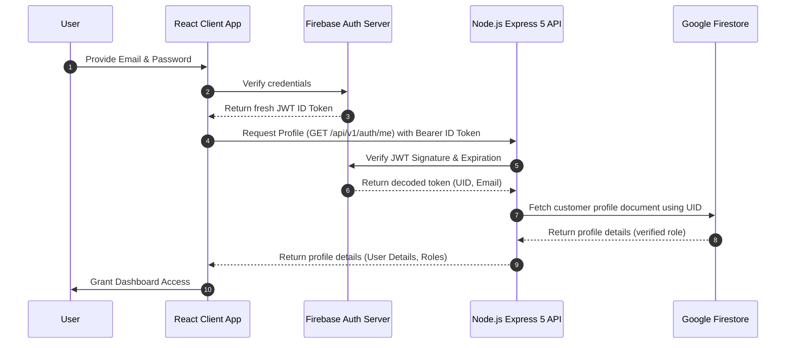

# 12. Authentication & Security Documentation

## A. Authentication Flow
EvaraOne utilizes a high-security, token-based authentication flow powered by **Google Firebase Auth** and the **Firebase Node Admin SDK**:

---

## B. Session Persistence
* To prevent session hijack vulnerabilities, EvaraOne enforces strict **Browser Session Persistence** (`browserSessionPersistence`) inside the Firebase Client SDK.
* Authentication states are kept in memory and transient storage rather than persistent local storage.
* If a user closes the browser or terminates the tab session, their authentication token is cleared, requiring a fresh login on the next visit.

---

## C. API Security Controls

### 1. Unified Authentication Middleware (`auth.middleware.js`)
* Every protected route runs through `requireAuth`.
* Extracts the token from the standard authorization header:
  `Authorization: Bearer <ID_Token>`
* Verifies signature validity and checks for token expiration.
* Rejects requests missing a valid user context with `401 Unauthorized` before processing continues.

### 2. Role-Based Access Control (RBAC) Middleware (`rbac.middleware.js`)
* Restricts access to sensitive routes by checking the user's role against authorized roles:
  `router.post("/zones", rbac(["superadmin"]), createZone);`
* **Superadmin Privilege**: The `superadmin` role bypasses all route access restrictions.
* **Viewer Restrictions**: Viewer accounts are allowed to query data using `GET` requests, but any data-modifying requests (`POST`, `PUT`, `DELETE`, `PATCH`) are immediately rejected with a `403 Access denied: viewer accounts cannot modify data` error.

### 3. Multi-Tenant Tenancy Validation (`tenantCheck.middleware.js`)
* Prevents data leaks in multi-tenant environments by validating resource ownership.
* When querying a device's telemetry, the middleware extracts the target device ID and compares its owner ID against the user's logged-in tenant ID.
* Any unauthorized access attempts are blocked with a `403 Forbidden` response.

---

## D. Advanced Rate Limiting
To protect against brute-force attacks and denial-of-service (DDoS) attempts, critical endpoints are protected by rate-limiting rules:
* **Global API Rate Limit**: Standard routes are capped at **200 requests per 15 minutes** per IP address.
* **Auth Rate Limiter (`authLimiter.js`)**: Sensitive authentication routes (such as `/verify-token`) are strictly capped at **5 requests per 15 minutes** per IP address. If a user exceeds this limit, the system returns a `429 Too Many Requests` error with an informative cooldown message.
